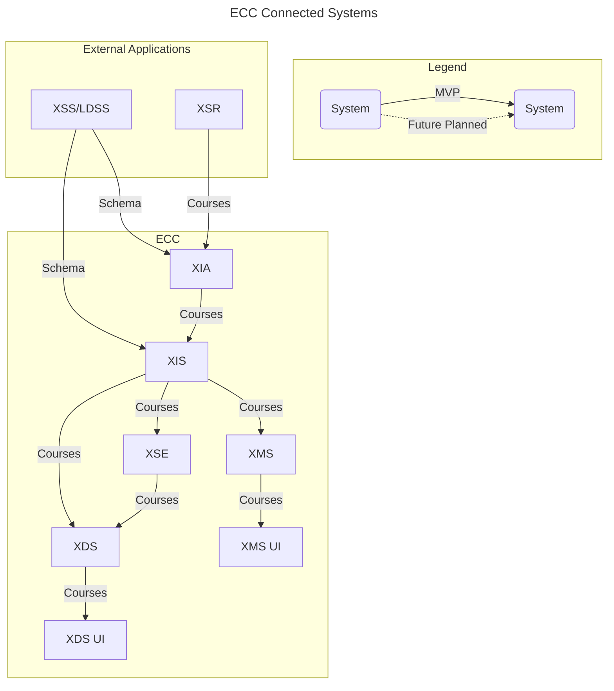

# Enterprise Course Catalog: OPENLXP-XDS
The Experience Discovery Service (XDS) is the administration and configuration backend to the human-facing XDS application, enabling an Experience Consumer or Experience Facilitator to quickly locate a pertinent learning experience metadata record that has been indexed by the [Experience Index Service (XIS)](https://github.com/adlnet/ecc-openlxp-xis). Because the XDS is a separate application, it can be deployed in a separate environment from the XIS. It can even be configured to point to a different XIS and Experience Search engine (XSE) as needed. In addition, multiple XDS applications can be deployed and point to the same XIS, allowing for excellent installation and configuration flexibility.

## ECC System Architecture



## Prerequisites
### Install Docker & docker-compose
#### Windows & MacOS
- Download and install [Docker Desktop](https://www.docker.com/products/docker-desktop) (docker compose included)


#### Linux
You can download Docker Compose binaries from the
[release page](https://github.com/docker/compose/releases) on this repository.

Rename the relevant binary for your OS to `docker-compose` and copy it to `$HOME/.docker/cli-plugins`

Or copy it into one of these folders to install it system-wide:

* `/usr/local/lib/docker/cli-plugins` OR `/usr/local/libexec/docker/cli-plugins`
* `/usr/lib/docker/cli-plugins` OR `/usr/libexec/docker/cli-plugins`

(might require making the downloaded file executable with `chmod +x`)

### Python
`Python >=3.9` : Download and install it from here [Python](https://www.python.org/downloads/).

## 1. Clone the project
Clone the Github repository
```
git clone https://github.com/adlnet/ecc-openlxp-xds.git
```  

## 2. Set up your environment variables
- Create a `.env` file in the root directory
- The following environment variables are required:

| Environment Variable               | Description                                                                                                                                                                                                                                                                                                                                |
| ---------------------------------- | ------------------------------------------------------------------------------------------------------------------------------------------------------------------------------------------------------------------------------------------------------------------------------------------------------------------------------------------ |
| AWS_ACCESS_KEY_ID                  | The Access Key ID for AWS                                                                                                                                                                                                                                                                                                                  |
| AWS_SECRET_ACCESS_KEY              | The Secret Access Key for AWS                                                                                                                                                                                                                                                                                                              |
| AWS_DEFAULT_REGION                 | The region for AWS                                                                                                                                                                                                                                                                                                                         |
| CSRF_COOKIE_DOMAIN                 | The domain to be used when setting the CSRF cookie. This can be useful for easily allowing cross-subdomain requests to be excluded from the normal cross site request forgery protection.                                                                                                                                                  |
| CSRF_TRUSTED_ORIGINS               | A list of trusted origins for unsafe requests                                                                                                                                                                                                                                                                                              |
| DB_HOST                            | The host name, IP, or docker container name of the database                                                                                                                                                                                                                                                                                |
| DB_NAME                            | The name to give the database                                                                                                                                                                                                                                                                                                              |
| DB_PASSWORD                        | The password for the user to access the database                                                                                                                                                                                                                                                                                           |
| DB_ROOT_PASSWORD                   | The password for the root user to access the database, should be the same as `DB_PASSWORD` if using the root user                                                                                                                                                                                                                          |
| DB_USER                            | The name of the user to use when connecting to the database. When testing use root to allow the creation of a test database                                                                                                                                                                                                                |
| DJANGO_SUPERUSER_EMAIL             | The email of the superuser that will be created in the application                                                                                                                                                                                                                                                                         |
| DJANGO_SUPERUSER_PASSWORD          | The password of the superuser that will be created in the application                                                                                                                                                                                                                                                                      |
| DJANGO_SUPERUSER_USERNAME          | The username of the superuser that will be created in the application                                                                                                                                                                                                                                                                      |
| ENTITY_ID                          | The Entity ID used to identify this application to Identity Providers when using Single Sign On                                                                                                                                                                                                                                            |
| LOG_PATH                           | The path to the log file to use                                                                                                                                                                                                                                                                                                            |
| SECRET_KEY_VAL                     | The Secret Key for Django                                                                                                                                                                                                                                                                                                                  |
| SP_PRIVATE_KEY                     | The Private Key to use when this application communicates with Identity Providers to use Single Sign On                                                                                                                                                                                                                                    |
| SP_PUBLIC_CERT                     | The Public Key to use when this application communicates with Identity Providers to use Single Sign On                                                                                                                                                                                                                                     |
| XAPI_ALLOW_ANON                    | If `true` (default) will allow forwarding of anonymous xAPI Statements. Not compatible with `XAPI_USE_JWT`.                                                                                                                                                                                                                                |
| XAPI_ANON_MBOX                     | The mbox email value to use for anonymous xAPI actors if `XAPI_ALLOW_ANON` is enabled. Defaults to `anonymous@example.com`.                                                                                                                                                                                                                |
| XAPI_USE_JWT                       | If this variable is set, attempt to use the value of a JWT auth token to derive the xAPI actor account. If not set the actor will be identified by mbox email. Not compatible with `XAPI_ALLOW_ANON`.`XAPI_ACTOR_ACCOUNT_HOMEPAGE` - Set the `$.actor.account.homePage` field on xAPI Statements. Only used when `XAPI_USE_JWT` is `true`. |
| XAPI_ACTOR_ACCOUNT_NAME_JWT_FIELDS | A comma-separated list of fields to check in the JWT for the `$.actor.account.name` field on xAPI Statements. The first non-empty string found will be chosen. Defaults to `activecac,preferred_username`. Only used when `XAPI_USE_JWT` is `true`.                                                                                        |


## 3. Deployment
1. Create the OpenLXP docker network. Open a terminal and run the following command in the root directory of the project.
    ```
    docker network create openlxp
    ```

2. Run the command below to deploy XDS along with its resources
    ```
    docker-compose up -d --build
    ```

## 4. Configuration for XDS
1. Navigate over to `http://localhost:8100/admin/` in your browser and login to the Django Admin page with the admin credentials set in your `.env` (`DJANGO_SUPERUSER_EMAIL` & `DJANGO_SUPERUSER_PASSWORD`)

2. <u>CONFIGURATIONS</u>
    - Configure Experience Discovery Service (XDS)
        1. Click on `Xds configurations` > `Add Xds configuration`
            - Enter the configurations below:
                - Under XDS settings, select the `Default user group` from the dropdown list: The Default user group is a group for new users to be assigned to automatically.
                
                - Under XIS settings, add the `Target XIS metadata api`: Metadata API Endpoint to connect to on an XIS instance.

                - Under XSE settings, add the `Target XSE host` & `Target XSE index`: Hostname and port of XSE instance to use. The host is the hostname/port of XSE and the index is the index of data to use on the XSE instance.

    - Configure Experience Discovery Service - User Interface (XDS-UI): 
        1. Click `Add Xdsui configurations` > `Add Xdsui configuration` 
            - Enter the configurations below:

                - `Search results per page`: Number of results that should be displayed on a search page on the UI.

                - `Xds configuration`: Select the XDS Configuration to use.

                - `Course img fallback`: Image to use if no image is supplied in the experience

    - Course information mappings
        1. Click `Course information mappings` > `Add course information mapping`: Default values will be set. Save the right mappings for XDS UI fields with backend data fields. 

3. <u>CORE</u>
    - Course spotlights: Configure Spotlight Courses in XDS-UI
        1. Click on `Course spotlights` > `Add course spotlight`
            - Enter the configurations below:

                - `Course id`: The ID of the course to add.

                - `Active`: Whether this course should be shown in the Spotlight Courses section.
    
    - Search filters: Configure Search Filters in XDS-UI:
        1. Click on `Search filter` > `Add search filter`
            - Enter the configurations below:

                - `Display name`: The name to use to label the filter in the UI.

                - `Field name`: The name of the field in ElasticSearch.

                - `Xds ui configuration`: Select the XDS UI Configuration to use.

                - `Filter type`: The type of filter to use.

                - `Active`: Whether this filter should be shown in the search results page.

    - Course detail hightlights: Add additional fields to be displayed on XDS-UI.
        1. Click on `Course detail highlights` > `Add course detail highlight`
            - Enter the configurations below:

                - `Display name`: The name to use to label the filter in the UI.

                - `Field name`: The name of the field in ElasticSearch.

                - `Xds ui configuration`: Select the XDS UI Configuration to use.

                - `Filter type`: The type of filter to use.

                - `Active`: Whether this filter should be shown in the search results page.

4. <u>[OPENLXP AUTHENTICATION](https://pypi.org/project/openlxp-authentication/)</u>
    - Saml configurations: Configure Security Assertion Markup Language (SAML)
        1. Click on `Saml configurations` > `Add Saml configuration`
            - Enter configurations below:

                - `Name`: The name that will be used to identify the IdP in the URL.

                - `Entity id`: The unique name provided by the IdP.

                - `Url`: The connection URL to connect to the IdP at.

                - `Cert`: The public cert used to connect to the IdP.

                - `Attribute mapping`: The JSON formatted mapping to convert attributes provided by the IdP, to a User in this system.

5. <u>OPENLXP_NOTIFICATIONS</u>
    - Templates: Create customized email template content. (default template - edlm-subscribed-list-update)
        1. Click on `Templates` > `Add template`
            - Enter the configurations below:

                - `Template Type`:  Add a reference name for the Template.
                - `message`: Add the email content here.
        
                    Note: Add content formatted as HTML here. You can add the following variables in the content.

                    {name:}
                    {date_time:}
                    {list_name:}
                    {author:}

    - Subjects:  Add the subject line for the email notification. (default subject line "ECC New Resource Alert!" will be set)
        1. Click on `Subjects` > `Add subject`

    - Emails: Set up the configurations for email notifications. (default email configuration for XDS - Subscribed_list_update)
        1. click on `Emails` > `Add email`

            - Enter the configurations below:
                - `Sender`:  Add the sender email address from where notification alerts originate.

                - `Reference`:  Add a reference name for the Email configuration.

                - `Subject`: Select a 'subject' from the drop down options set up previously.

                - `Template`: Select a 'template' from the drop down options set up previously.

## 5. Removing Deployment
To destroy the created resources, simply run the docker-compose command below in your terminal:
```
docker-compose down
```

##Troubleshooting
- If the container builds but crashes or logs an error of unrecognized commands, the issue is usually incorrect line endings. Most IDEs/Text Editors allow changing the line endings, but the dos2unix utility can also be used to change the line endings of `start-app.sh` and `start-server.sh` to LF.


- A good basic troubleshooting step is to use `docker-compose down` and then `docker-compose up --build` to rebuild the app image; however, this will delete everything in the database.

- XMLSEC
    - If the build fails when pip tries to install xmlsec, the issue is usually missing libraries.

    - The xmlsec package includes instructions for installing the libraries on common platforms in the [documentation](https://github.com/mehcode/python-xmlsec/blob/master/README.rst#install)

# Testing

To run the automated tests on the application run the command below

Test coverage information will be stored in an htmlcov directory

```bash
docker-compose --env-file .env run app sh -c "coverage run manage.py test && coverage html && flake8"
```

# Authentication

The environment variables `SP_PUBLIC_CERT`, `SP_PRIVATE_KEY` , and `SP_ENTITY_ID` must be defined (if using docker-compose the variables can be passed through).

Information on the settings for the authentication module can be found on the [OpenLXP-Authentication repo](https://github.com/adlnet/openlxp-authentication).


# Authorization

The setting `OPEN_ENDPOINTS` can be defined in the django settings file.
It is a list of strings (regex notation may be used) for URLs that should not check for authentication or authorization.

# Additional Info

Additional information about ECC can be found in our [ECC wiki](https://github.com/adlnet/ecc-openlxp-xds-ui/wiki)

# License

 This project uses the [Apache](http://www.apache.org/licenses/LICENSE-2.0) license.
